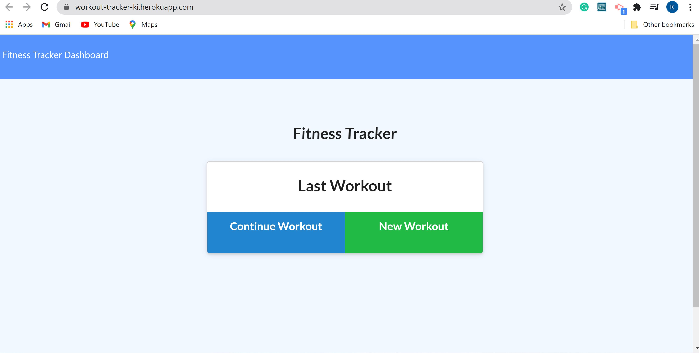

# workout-tracker

## Links

[Deployed Application](https://workout-tracker-ki.herokuapp.com/)

## Description

* As a user, I want to be able to view create and track daily workouts. I want to be able to log multiple exercises in a workout on a given day. I should also be able to track the name, type, weight, sets, reps, and duration of exercise. If the exercise is a cardio exercise, I should be able to track my distance traveled.

## Table of Contents

- [Installation](#installation)
- [Usage](#usage)
- [License](#license)
- [Contributing](#contributing)
- [Questions](#questions)

## Installation

To install the app users should download the repository, install the required dependencies listed in the package.JSON file by running "npm i" in the root folder of the repository.

## Usage

After the packages are installed, application will be invoked by running the `node server.js` command in the terminal in the root folder of the repository.

## License

N/A

## Contributing

Everyone can contribute and make the next version of the app.

## Questions

Contact me for additional questions or to say "Hi":

- [GitHub Profile](https://github.com/kiankovskaia)

- [email](mailto:kiankovskaia@gmail.com)

## Demo

The following video demonstrates the application functionality:

